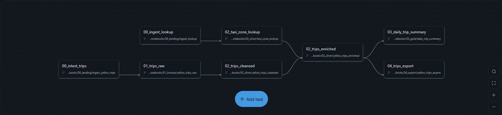

# NYC Taxi — Databricks Lakehouse Demo

A end-to-end data engineering demo built on Databricks, using the NYC Yellow Taxi dataset to showcase a production-style Medallion pipeline with Unity Catalog governance, Delta Lake storage, and orchestrated Workflow Jobs.

---

## Overview

This project demonstrates how to build a scalable, governed data lakehouse on Databricks. It download raw NYC Yellow Taxi trip data through REST API to databricks managed volume, ingest and transforms it through Bronze → Silver → Gold layers, produce a clean analytical dataset and export partitioned data to a seperate external ADLS storage — all orchestrated via a Databricks Workflow Job backed by Git.

---

## Databricks Features Showcased

### Unity Catalog
All data assets (tables, schemas, volumes) are registered in Unity Catalog, providing a single governance layer across the pipeline. The `one_off/creating_catalogs_schemas_volume` notebook provisions the catalog structure before any data lands.

### Delta Tables
Every layer of the pipeline persists data as Delta tables, enabling ACID transactions, time-travel, and efficient incremental processing across the Medallion layers.

### Databricks Workflow Jobs (Lakeflow)
The entire pipeline is orchestrated as a multi-task Databricks Job (`NYC taxi job`) with explicit task dependencies defined as a DAG. The job is connected to this Git repository (`main` branch), so notebook changes are version-controlled and the job always runs from source.

### External Storage (ADLS)
Export data are sent to an external storage that setup with seperate databricks access connector, credential and access role, simulate the seperate the target location requested by another business unit.

### Parameterized Notebooks
Utility modules (`date_utils.py`, `file_downloader.py`) and notebooks accept parameters, making runs reusable across date ranges and environments.

---

## Architecture

### Medallion Architecture

The pipeline follows the standard Bronze / Silver / Gold layering pattern:

```
ADLS (Raw Source)
       │
       ▼
  00_landing        ← Ingestion: ingest_lookup, ingest_yellow_trips
       │
       ▼
  01_bronze         ← Raw Delta table: yellow_trips_raw
       │
       ▼
  02_silver         ← Cleansed & enriched:
       │                 taxi_zone_lookup (SCD Type 2 dimension)
       │                 yellow_trips_cleansed
       │                 yellow_trips_enriched
       │
       ▼
  03_gold           ← Aggregated: daily_trip_summary
       │
       ▼
  04_export         ← Downstream delivery: yellow_trips_export
```

### SCD Type 2 — Dimension Table
The `taxi_zone_lookup` dimension table in the Silver layer is managed as a **Slowly Changing Dimension Type 2 (SCD2)**. Historical records are preserved with effective date tracking, allowing the pipeline to accurately join trips to the zone information that was valid at the time of the trip.

---

## Repository Structure

```
nyctaxi_project/
├── ad_hoc/                          # Exploratory notebooks (not in pipeline)
│   ├── purge_tables_from_date
│   ├── yellow_taxi_eda
│   └── yellow_taxi_eda_2
│
├── modules/                         # Shared Python utilities
│   ├── date_utils.py                # Date range helpers
│   └── file_downloader.py           # ADLS file download helpers
│
├── one_off/                         # One-time setup scripts
│   ├── initial_load/
│   ├── creating_catalogs_schemas_volume   # Unity Catalog provisioning
│   └── load_taxi_zone_lookup              # Seeds the zone dimension
│
└── transformations/
    └── notebooks/
        ├── 00_landing/
        │   ├── ingest_lookup
        │   └── ingest_yellow_trips
        ├── 01_bronze/
        │   └── yellow_trips_raw
        ├── 02_silver/
        │   ├── taxi_zone_lookup        # SCD2 dimension
        │   ├── yellow_trips_cleansed
        │   └── yellow_trips_enriched
        ├── 03_gold/
        │   └── daily_trip_summary
        └── 04_export/
            └── yellow_trips_export
```

---

## Workflow DAG

The `NYC taxi job` defines the following task dependency graph:





Both ingestion tasks run in parallel, converge at the Silver enrichment step, and fan out to the Gold aggregation and export tasks.

---

## Prerequisites

- Databricks workspace with Unity Catalog enabled
- Azure Data Lake Storage Gen2 account with an external location configured in Unity Catalog
- Databricks Repos connected to this repository (`main` branch)
- A cluster or Serverless compute with access to the Unity Catalog metastore

---

## Getting Started

1. **Provision Unity Catalog assets** — run `one_off/creating_catalogs_schemas_volume` once to create the catalog, schemas, and volumes.
2. **Seed the dimension** — run `one_off/load_taxi_zone_lookup` to load the initial taxi zone reference data.
3. **Configure the Job** — import the job definition and configure job parameters.
4. **Run the pipeline** — trigger `NYC taxi job` manually or on a schedule. Monitor task progress in the Jobs UI.

For ad-hoc exploration, the notebooks under `ad_hoc/` can be run independently against any layer of the catalog.

---

## Design Decisions

| Decision | Rationale |
|---|---|
| Medallion Architecture | Clear separation of concerns between raw, cleansed, and business-ready data; enables incremental reprocessing at any layer |
| SCD2 for taxi zones | Preserves historical zone boundaries so trip-to-zone joins are point-in-time accurate |
| Unity Catalog | Single governance layer for access control, lineage, and discoverability across all Delta assets |
| Git-backed Workflow Job | Notebook source of truth lives in version control; the job always executes the committed state of `main` |
| Shared modules | `date_utils.py` and `file_downloader.py` avoid logic duplication across notebooks and make parameterized backfills straightforward |
